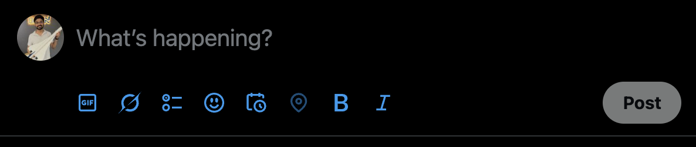

## Remove For You X 🗑️✨

[](https://en.wikipedia.org/wiki/You_only_live_once)
[](https://en.wikipedia.org/wiki/Sanity)

> *A browser extension that removes X's "For You" tab faster than you can say "algorithmic timeline" — because sometimes the best recommendation algorithm is the DELETE button.*

---

####  What's This About?

Remember when Twitter was just a chronological timeline of your friends tweeting about their lunch? Pepperidge Farm remembers. And so do we.

It takes one look at that "For You" tab and says "This does not spark joy" — then **YEETS** it into the digital void where it belongs.

#### Why Would I Want This?

Great question! Here's why you might want to join the resistance against algorithmic timeline:

#### The "For You" Tab is Like That Friend Who...
- 🎪 Creates drama where none existed (looking at you, engagement algorithms)
- 🍿 Feeds you junk food instead of what you actually asked for
- 🎯 Thinks they know what you want better than you do (spoiler: they don't)

#### With This Extension, You Get:
- 🧘 Peace of mind (chronological timelines are zen)
- 🎯 Content you actually chose to see
- 🧠 Your sanity back (priceless)

---

### Before
[](before.png)

---

### After

[](after.png)

---

#### 📦 Installation

#### Chrome/Chromium-based Browsers (Chrome, Edge, Brave, etc.)

1. Download this repository or clone it:
   ```bash
   git clone https://github.com/jdk2588/viber-coder/remove-for-you-x.git
   ```
   
2. Open Chrome and navigate to `chrome://extensions/`

3. Enable "Developer mode" (toggle in the top right)

4. Click "Load unpacked" and select the extension folder

5. 🎉 **Boom!** The "For You" tab has left the building

---

#### 🛠️ How It Works (The Magic Behind The Curtain)

Our extension uses cutting-edge technology (aka DOM manipulation) to achieve its goals

#### ⭐ Star This Repo!

If this extension saved your sanity, helped you procrastinate less (or more), or just made you chuckle, give us a star! ⭐

It's free, it makes us happy, and it helps other developers find this digital life preserver in the vast ocean of browser extensions.

